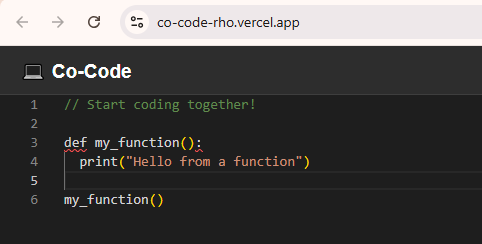
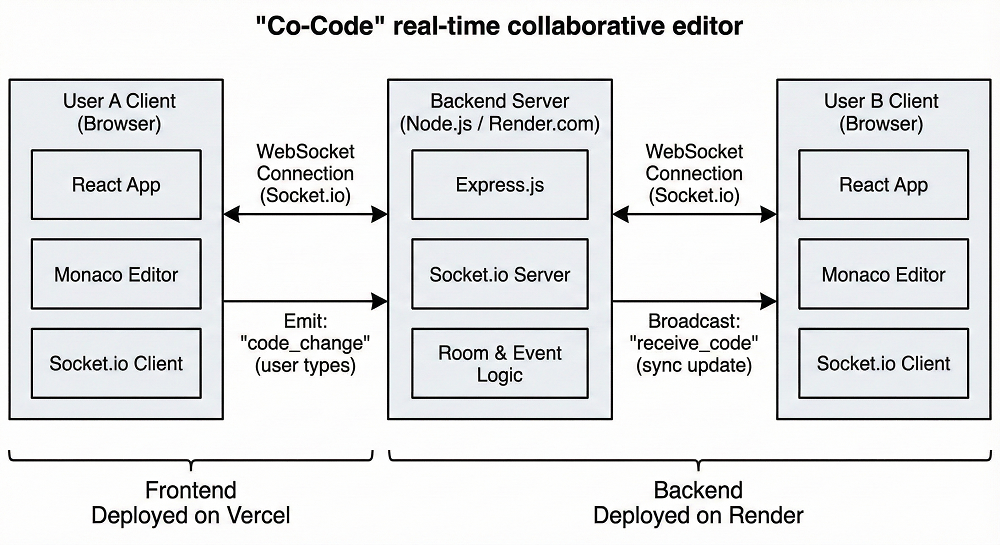

# 💻 Co-Code: Real-Time Collaborative Code Editor

[](https://co-code-rho.vercel.app/)
[]()

**Co-Code** is a real-time collaborative code editor that allows multiple users to edit the same file simultaneously. Think of it as "Google Docs for Code." It utilizes **WebSockets** for low-latency synchronization and **Monaco Editor** (the engine behind VS Code) for a premium coding experience.



---

## 🚀 Features

* **Real-Time Synchronization:** Typing updates appear instantly on all connected clients using `socket.io`.
* **Room-Based Collaboration:** Users can join specific "Rooms" to collaborate in isolated sessions.
* **Syntax Highlighting:** Integrated **Monaco Editor** supports JavaScript syntax out of the box.
* **Production Ready:**
    * **Frontend** deployed on **Vercel**.
    * **Backend** deployed on **Render** (Node.js).

---

## 🛠️ Tech Stack

* **Frontend:** React.js, `@monaco-editor/react`
* **Backend:** Node.js, Express.js
* **Real-Time Engine:** Socket.io (WebSockets)
* **DevOps:** Docker (optional), Render (Backend Hosting), Vercel (Frontend Hosting)

---

## 🏗️ Architecture

The application follows a **Client-Server** architecture using Event-Driven Communication.

1.  **Connection:** The React Client establishes a bi-directional WebSocket connection with the Node.js Server.
2.  **Room Joining:** Users emit a `join_room` event to subscribe to a specific channel.
3.  **Broadcasting:** When a user types, the client emits `code_change`. The server broadcasts this event to all *other* sockets in the same room.
4.  **Loop Prevention:** The client logic ensures that incoming broadcasts do not trigger a "re-broadcast," preventing infinite feedback loops.



---

## 🏃‍♂️ Getting Started (Local Setup)

Follow these steps to run the project on your local machine.

### Prerequisites
* Node.js (v14 or higher)
* npm

### 1. Clone the Repository
```bash
git clone https://github.com/TouseefQ/co-code.git
cd co-code
```

## 2. Setup the Server (Backend)
Open a terminal and navigate to the server folder:

```bash
cd server
npm install
npm start
```
The server will start on `http://localhost:3001`.

## 3. Setup the Client (Frontend)
Open a new terminal and navigate to the client folder:

```bash
cd client
npm install
npm start
```
The React app will open on `http://localhost:3000`.

## ☁️ Deployment
This project is deployed using a distributed strategy to handle WebSocket connections.

* Backend (API & Sockets): Hosted on Render.com.

    * Build Command: `npm install`

    * Start Command: `node index.js`

* Frontend (UI): Hosted on Vercel.

    * Root Directory: `client`